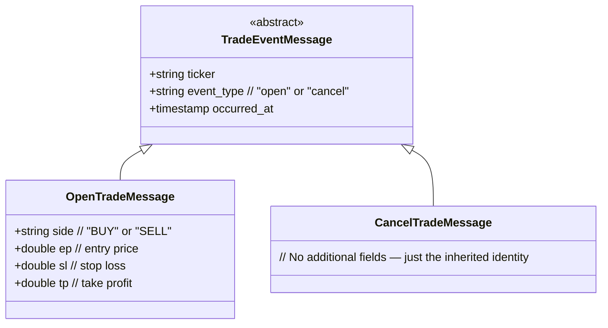

```mermaid
classDiagram
    class TradeEventMessage {
        <<abstract>>
        +string ticker
        +string event_type   // "open" or "cancel"
        +timestamp occurred_at
    }

    class OpenTradeMessage {
        +string side          // "BUY" or "SELL"
        +double ep            // entry price
        +double sl            // stop loss
        +double tp            // take profit
    }

    class CancelTradeMessage {
        // No additional fields — just the inherited identity
    }

    TradeEventMessage <|-- OpenTradeMessage
    TradeEventMessage <|-- CancelTradeMessage
```
