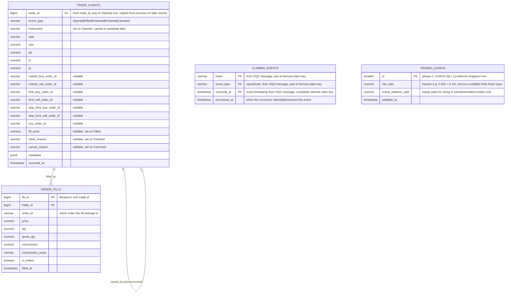

```mermaid
erDiagram
    TRADE_EVENTS ||--o| TRADE_EVENTS : "caused_by (previous event)"

    TRADE_EVENTS {
        bigint trade_id FK "from trade_id_seq on Opened row; copied from previous on later events"
        varchar event_type "Opened|Filled|Protected|Finished|Canceled"
        varchar instrument "set on Opened, carried in metadata after"
        varchar side
        numeric size
        numeric ep
        numeric sl
        numeric tp
        varchar market_buy_order_id "nullable"
        varchar market_sell_order_id "nullable"
        varchar limit_buy_order_id "nullable"
        varchar limit_sell_order_id "nullable"
        varchar stop_limit_buy_order_id "nullable"
        varchar stop_limit_sell_order_id "nullable"
        varchar oco_order_id "nullable"
        numeric fill_price "nullable, set on Filled"
        varchar close_reason "nullable, set on Finished"
        varchar cancel_reason "nullable, set on Canceled"
        jsonb metadata
        timestamp occurred_at
    }

    TRADE_EVENTS ||--o{ ORDER_FILLS : "filled_by"

    ORDER_FILLS {
        bigint fill_id PK "Binance's own trade id"
        bigint trade_id FK
        varchar order_id "which order this fill belongs to"
        numeric price
        numeric qty
        numeric quote_qty
        numeric commission
        varchar commission_asset
        boolean is_maker
        timestamp filled_at
    }

    CLAIMED_EVENTS {
        varchar ticker PK "from SQS message, part of derived claim key"
        varchar event_type PK "open|close, from SQS message, part of derived claim key"
        timestamp occurred_at PK "event timestamp from SQS message, completes derived claim key"
        timestamp processed_at "when the consumer claimed/processed this event"
    }

    TRADES_CONFIG {
        smallint id PK "always 1, CHECK (id = 1) enforces singleton row"
        numeric risk_ratio "fraction e.g. 0.001 = 0.1%, mirrors LevelsBot Risk Ratio input"
        numeric virtual_balance_usdt "equity used for sizing in virtual/simulated modes only"
        timestamp updated_at
    }
```
