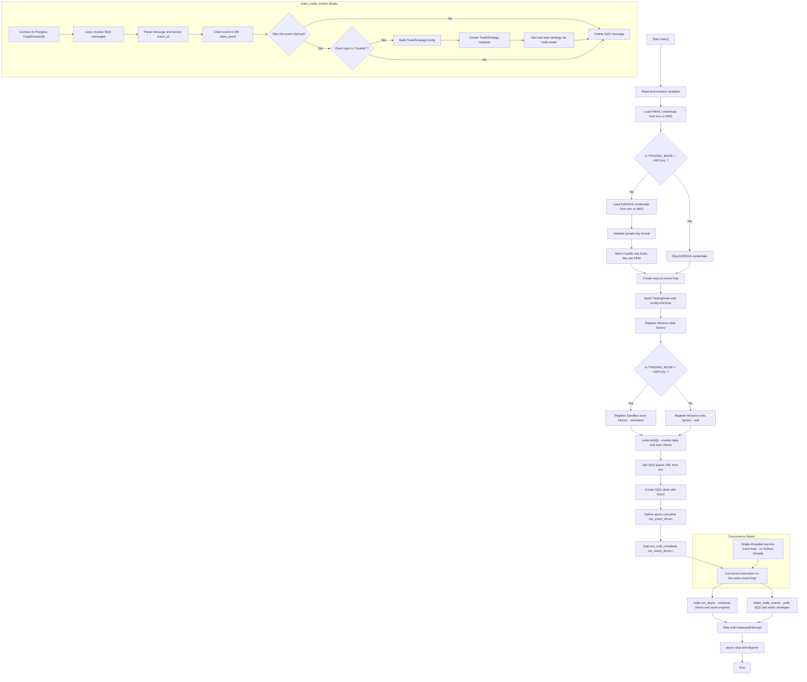

```mermaid
flowchart TD
    A["Start main()"] --> B["Read environment variables"]
    B --> C["Load HMAC credentials from env or AWS"]
    C --> D{"Is TRADING_MODE = VIRTUAL ?"}
    D -- No --> E["Load Ed25519 credentials from env or AWS"]
    E --> F["Validate private key format"]
    F --> G["Warn if public key looks like raw PEM"]
    D -- Yes --> H["Skip Ed25519 credentials"]
    G --> I["Create asyncio event loop"]
    H --> I
    I --> J["Build TradingNode with config and loop"]
    J --> K["Register Binance data factory"]
    K --> L{"Is TRADING_MODE = VIRTUAL ?"}
    L -- Yes --> M["Register Sandbox exec factory - simulated"]
    L -- No --> N["Register Binance exec factory - real"]
    M --> O["node.build() - creates data and exec clients"]
    N --> O
    O --> P["Get SQS queue URL from env"]
    P --> Q["Create SQS client with boto3"]
    Q --> R["Define async coroutine run_event_driven"]
    R --> S["loop.run_until_complete( run_event_driven )"]
    S --> T["Concurrent execution on the same event loop"]
    T --> U["node.run_async - connects clients and starts engines"]
    T --> V["listen_trade_events - polls SQS and starts strategies"]
    U & V --> W["Wait until KeyboardInterrupt"]
    W --> X["async stop and dispose"]
    X --> Y[End]

    subgraph listen_trade_events_detail["listen_trade_events details"]
        V1["Connect to Postgres TradeEventsDB"] --> V2["Loop: receive SQS messages"]
        V2 --> V3["Parse message and extract event_id"]
        V3 --> V4["Claim event in DB - claim_event"]
        V4 --> V5{"Was the event claimed?"}
        V5 -- No --> V6["Delete SQS message"]
        V5 -- Yes --> V7{"Event type is 'Created' ?"}
        V7 -- Yes --> V8["Build TradeStrategyConfig"]
        V8 --> V9["Create TradeStrategy instance"]
        V9 --> V10["Add and start strategy via node.trader"]
        V10 --> V6
        V7 -- No --> V6
    end

    subgraph concurrency_model["Concurrency Model"]
        Note["Single-threaded asyncio event loop - no Python threads"]
        Note --> T
    end
```
