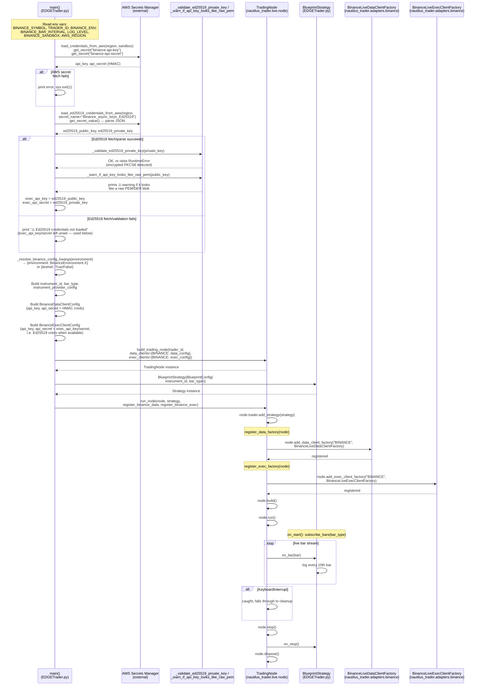

```mermaid
sequenceDiagram
    participant Main as main()<br/>(EDGETrader.py)
    participant AWS as AWS Secrets Manager<br/>(external)
    participant Val as _validate_ed25519_private_key /<br/>_warn_if_api_key_looks_like_raw_pem
    participant Node as TradingNode<br/>(nautilus_trader.live.node)
    participant Strategy as BlueprintStrategy<br/>(EDGETrader.py)
    participant DataFactory as BinanceLiveDataClientFactory<br/>(nautilus_trader.adapters.binance)
    participant ExecFactory as BinanceLiveExecClientFactory<br/>(nautilus_trader.adapters.binance)
 
    Note over Main: Read env vars:<br/>BINANCE_SYMBOL, TRADER_ID, BINANCE_ENV,<br/>BINANCE_BAR_INTERVAL, LOG_LEVEL,<br/>BINANCE_SANDBOX, AWS_REGION
 
    Main->>AWS: load_credentials_from_aws(region, sandbox)<br/>get_secret("binance-api-key")<br/>get_secret("binance-api-secret")
    AWS-->>Main: api_key, api_secret (HMAC)
 
    alt AWS secret fetch fails
        Main->>Main: print error, sys.exit(1)
    end
 
    Main->>AWS: load_ed25519_credentials_from_aws(region,<br/>secret_name="Binance_async_keys_Ed25519")<br/>get_secret_value() → parse JSON
    AWS-->>Main: ed25519_public_key, ed25519_private_key
 
    alt Ed25519 fetch/parse succeeds
        Main->>Val: _validate_ed25519_private_key(private_key)
        Val-->>Main: OK, or raise RuntimeError<br/>(encrypted PKCS8 detected)
 
        Main->>Val: _warn_if_api_key_looks_like_raw_pem(public_key)
        Val-->>Main: prints ⚠️ warning if it looks<br/>like a raw PEM/DER blob
 
        Main->>Main: exec_api_key = ed25519_public_key<br/>exec_api_secret = ed25519_private_key
    else Ed25519 fetch/validation fails
        Main->>Main: print "⚠️ Ed25519 credentials not loaded"<br/>(exec_api_key/secret left unset — used below)
    end
 
    Main->>Main: _resolve_binance_config_kwargs(environment)<br/>→ {environment: BinanceEnvironment.X}<br/>or {testnet: True/False}
 
    Main->>Main: Build instrument_id, bar_type,<br/>instrument_provider_config
 
    Main->>Main: Build BinanceDataClientConfig<br/>(api_key, api_secret = HMAC creds)
    Main->>Main: Build BinanceExecClientConfig<br/>(api_key, api_secret = exec_api_key/secret,<br/>i.e. Ed25519 creds when available)
 
    Main->>Node: build_trading_node(trader_id,<br/>data_clients={BINANCE: data_config},<br/>exec_clients={BINANCE: exec_config})
    Node-->>Main: TradingNode instance
 
    Main->>Strategy: BlueprintStrategy(BlueprintConfig(<br/>instrument_id, bar_type))
    Strategy-->>Main: Strategy instance
 
    Main->>Node: run_node(node, strategy,<br/>register_binance_data, register_binance_exec)
 
    Node->>Node: node.trader.add_strategy(strategy)
 
    Note over Node: register_data_factory(node)
    Node->>DataFactory: node.add_data_client_factory("BINANCE",<br/>BinanceLiveDataClientFactory)
    DataFactory-->>Node: registered
 
    Note over Node: register_exec_factory(node)
    Node->>ExecFactory: node.add_exec_client_factory("BINANCE",<br/>BinanceLiveExecClientFactory)
    ExecFactory-->>Node: registered
 
    Node->>Node: node.build()
    Node->>Node: node.run()
 
    Note over Strategy: on_start(): subscribe_bars(bar_type)
    loop live bar stream
        Node->>Strategy: on_bar(bar)
        Strategy->>Strategy: log every 10th bar
    end
 
    alt KeyboardInterrupt
        Node->>Node: caught, falls through to cleanup
    end
 
    Node->>Node: node.stop()
    Node->>Strategy: on_stop()
    Node->>Node: node.dispose()
```
