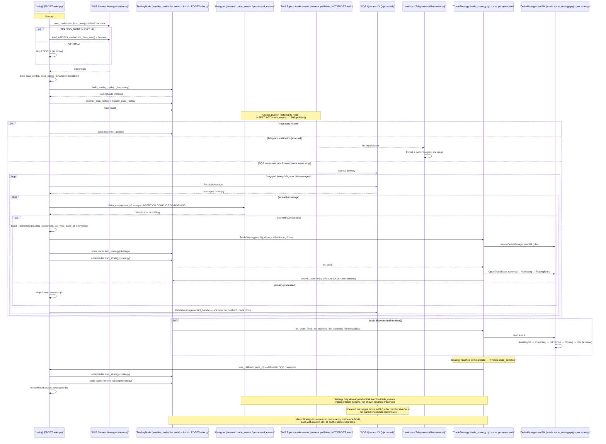

```mermaid
sequenceDiagram
    participant Main as "main() (EDGETrader.py)"
    participant AWS as "AWS Secrets Manager (external)"
    participant Node as "TradingNode (nautilus_trader.live.node) – built in EDGETrader.py"
    participant PG as "Postgres (external: trade_events / processed_events)"
    participant SNS as "SNS Topic – trade-events (external publisher, NOT EDGETrader)"
    participant SQS as "SQS Queue + DLQ (external)"
    participant Lambda as "Lambda – Telegram notifier (external)"
    participant Strategy as "TradeStrategy (trade_strategy.py) – one per open trade"
    participant SM as "OrderManagementSM (inside trade_strategy.py) – per strategy"

    Note over Main: Startup
    Main->>AWS: load_credentials_from_aws() – HMAC for data
    alt TRADING_MODE != VIRTUAL
        Main->>AWS: load_ed25519_credentials_from_aws() – for exec
    else VIRTUAL
        Main->>Main: skip Ed25519 (as today)
    end
    AWS-->>Main: credentials

    Main->>Main: build data_config / exec_config (Binance or Sandbox)
    Main->>Node: build_trading_node(..., loop=loop)
    Node-->>Main: TradingNode instance

    Main->>Node: register_data_factory / register_exec_factory
    Main->>Node: node.build()

    Note over PG,SNS: Outbox publish (external to node)<br/>INSERT INTO trade_events → SNS.publish()

    par Node runs forever
        Main->>Node: await node.run_async()
    and Telegram notification (external)
        SNS-->>Lambda: fan-out delivery
        Lambda->>Lambda: format & send Telegram message
    and SQS consumer runs forever (same event loop)
        SNS->>SQS: fan-out delivery
        loop long-poll (every 20s, max 10 messages)
            Main->>SQS: ReceiveMessage
            SQS-->>Main: messages or empty

            loop for each message
                Main->>PG: claim_event(event_id)  -- async INSERT ON CONFLICT DO NOTHING
                PG-->>Main: claimed row or nothing

                alt claimed successfully
                    Main->>Main: Build TradeStrategyConfig (instrument, bar_type, trade_id, entry/sl/tp)
                    Main->>Strategy: TradeStrategy(config, close_callback=on_close)
                    Strategy->>SM: create OrderManagementSM (Idle)

                    Main->>Node: node.trader.add_strategy(strategy)
                    Main->>Node: node.trader.start_strategy(strategy)
                    Node-->>Strategy: on_start()

                    Strategy->>SM: OpenTradeEvent received → Validating → PlacingEntry
                    Strategy->>Node: submit_order(entry, client_order_id=deterministic)
                else already processed
                    Main->>Main: skip (idempotent no‑op)
                end

                Main->>SQS: DeleteMessage(receipt_handle)  -- ack now, not held until trade close
            end
        end
    end

    loop trade lifecycle (until terminal)
        Node->>Strategy: on_order_filled / on_rejected / on_canceled / price updates
        Strategy->>SM: feed event
        SM->>SM: AwaitingFill → Protecting → InPosition → Closing → Idle (terminal)
    end

    Note over Strategy: Strategy reaches terminal state → invokes close_callback()
    Strategy->>Main: close_callback(trade_id)  -- defined in SQS consumer
    Main->>Node: node.trader.stop_strategy(strategy)
    Main->>Node: node.trader.remove_strategy(strategy)
    Main->>Main: remove from active_strategies dict

    Note over Strategy,PG: Strategy may also append a final event to trade_events<br/>(implementation specific, not shown in EDGETrader.py)

    Note over SQS: Undeleted messages move to DLQ after maxReceiveCount<br/>– for manual inspection (defensive).
    Note over Node,Strategy: Many Strategy instances run concurrently inside one Node,<br/>each with its own SM, all on the same event loop.
```
