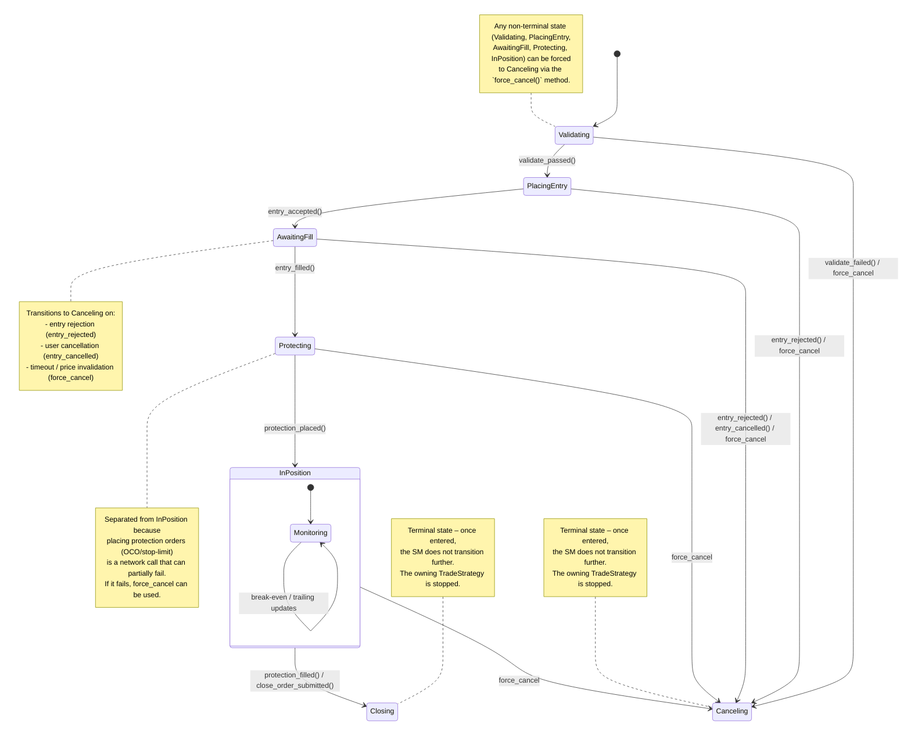

```mermaid
stateDiagram-v2
    [*] --> Validating

    Validating --> PlacingEntry: validate_passed()
    Validating --> Canceling: validate_failed() / force_cancel

    PlacingEntry --> AwaitingFill: entry_accepted()
    PlacingEntry --> Canceling: entry_rejected() / force_cancel

    AwaitingFill --> Protecting: entry_filled()
    AwaitingFill --> Canceling: entry_rejected() / entry_cancelled() / force_cancel

    Protecting --> InPosition: protection_placed()
    Protecting --> Canceling: force_cancel

    state InPosition {
        [*] --> Monitoring
        Monitoring --> Monitoring: break-even / trailing updates
    }

    InPosition --> Closing: protection_filled() / close_order_submitted()
    InPosition --> Canceling: force_cancel

    note right of AwaitingFill
        Transitions to Canceling on:
        - entry rejection (entry_rejected)
        - user cancellation (entry_cancelled)
        - timeout / price invalidation (force_cancel)
    end note

    note right of Protecting
        Separated from InPosition because
        placing protection orders (OCO/stop-limit)
        is a network call that can partially fail.
        If it fails, force_cancel can be used.
    end note

    note left of Canceling
        Terminal state – once entered,
        the SM does not transition further.
        The owning TradeStrategy is stopped.
    end note

    note left of Closing
        Terminal state – once entered,
        the SM does not transition further.
        The owning TradeStrategy is stopped.
    end note

    note left of Validating
        Any non-terminal state (Validating, PlacingEntry,
        AwaitingFill, Protecting, InPosition) can be forced
        to Canceling via the `force_cancel()` method.
    end note
```
