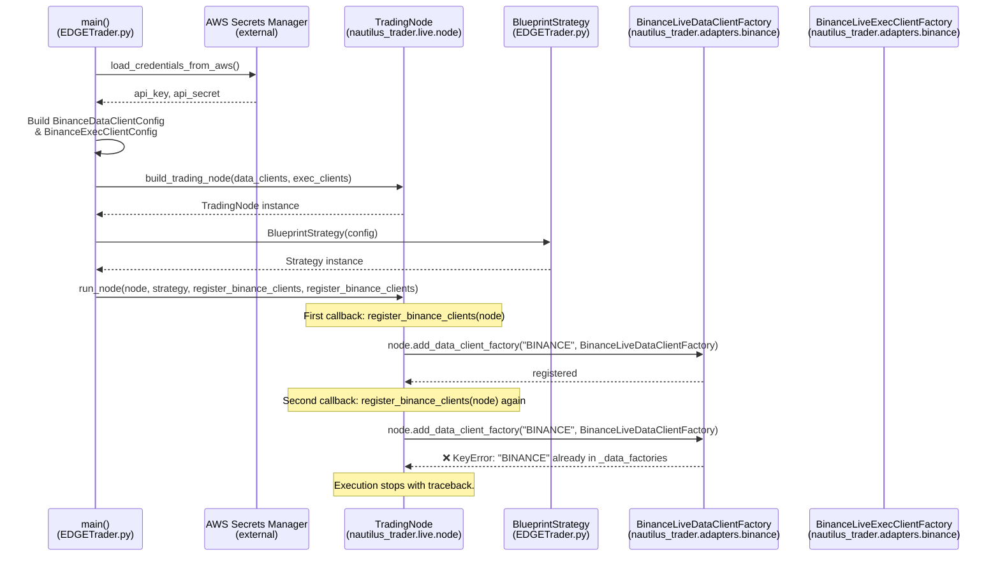

```mermaid
sequenceDiagram
    participant Main as main()<br/>(EDGETrader.py)
    participant AWS as AWS Secrets Manager<br/>(external)
    participant Node as TradingNode<br/>(nautilus_trader.live.node)
    participant Strategy as BlueprintStrategy<br/>(EDGETrader.py)
    participant DataFactory as BinanceLiveDataClientFactory<br/>(nautilus_trader.adapters.binance)
    participant ExecFactory as BinanceLiveExecClientFactory<br/>(nautilus_trader.adapters.binance)

    Main->>AWS: load_credentials_from_aws()
    AWS-->>Main: api_key, api_secret

    Main->>Main: Build BinanceDataClientConfig<br/>& BinanceExecClientConfig
    Main->>Node: build_trading_node(data_clients, exec_clients)
    Node-->>Main: TradingNode instance

    Main->>Strategy: BlueprintStrategy(config)
    Strategy-->>Main: Strategy instance

    Main->>Node: run_node(node, strategy, register_binance_clients, register_binance_clients)

    Note over Node: First callback: register_binance_clients(node)
    Node->>DataFactory: node.add_data_client_factory("BINANCE", BinanceLiveDataClientFactory)
    DataFactory-->>Node: registered

    Note over Node: Second callback: register_binance_clients(node) again
    Node->>DataFactory: node.add_data_client_factory("BINANCE", BinanceLiveDataClientFactory)
    DataFactory-->>Node: ❌ KeyError: "BINANCE" already in _data_factories

    Note over Node: Execution stops with traceback.
```
