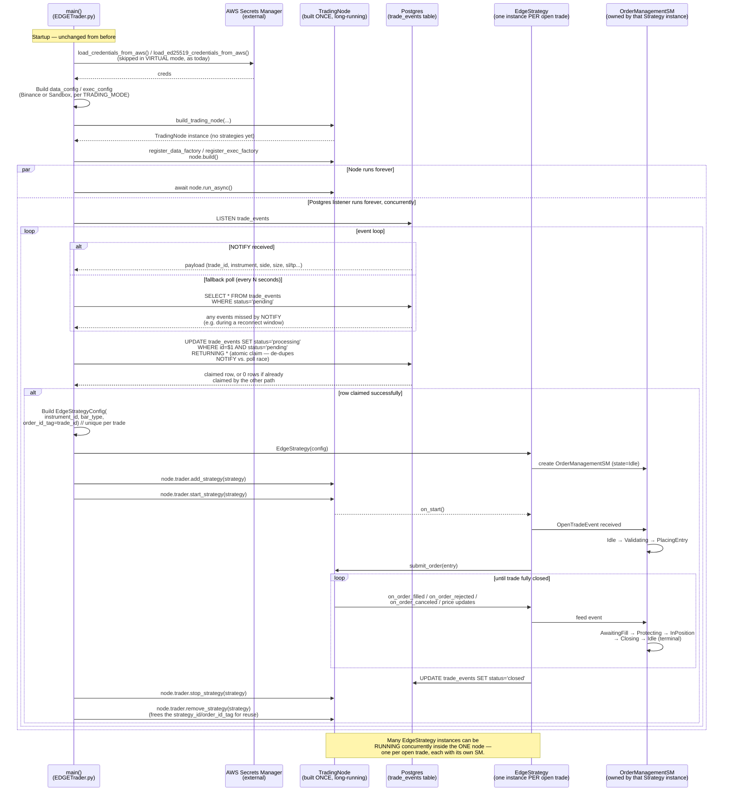

```mermaid
sequenceDiagram
    participant Main as main()<br/>(EDGETrader.py)
    participant AWS as AWS Secrets Manager<br/>(external)
    participant Node as TradingNode<br/>(built ONCE, long-running)
    participant PG as Postgres<br/>(trade_events table)
    participant Strategy as EdgeStrategy<br/>(one instance PER open trade)
    participant SM as OrderManagementSM<br/>(owned by that Strategy instance)

    Note over Main: Startup — unchanged from before
    Main->>AWS: load_credentials_from_aws() / load_ed25519_credentials_from_aws()<br/>(skipped in VIRTUAL mode, as today)
    AWS-->>Main: creds

    Main->>Main: Build data_config / exec_config<br/>(Binance or Sandbox, per TRADING_MODE)
    Main->>Node: build_trading_node(...)
    Node-->>Main: TradingNode instance (no strategies yet)

    Main->>Node: register_data_factory / register_exec_factory<br/>node.build()

    par Node runs forever
        Main->>Node: await node.run_async()
    and Postgres listener runs forever, concurrently
        Main->>PG: LISTEN trade_events
        loop event loop
            alt NOTIFY received
                PG-->>Main: payload (trade_id, instrument, side, size, sl/tp...)
            else fallback poll (every N seconds)
                Main->>PG: SELECT * FROM trade_events<br/>WHERE status='pending'
                PG-->>Main: any events missed by NOTIFY<br/>(e.g. during a reconnect window)
            end

            Main->>PG: UPDATE trade_events SET status='processing'<br/>WHERE id=$1 AND status='pending'<br/>RETURNING * (atomic claim — de-dupes<br/>NOTIFY vs. poll race)
            PG-->>Main: claimed row, or 0 rows if already<br/>claimed by the other path

            alt row claimed successfully
                Main->>Main: Build EdgeStrategyConfig(<br/>instrument_id, bar_type,<br/>order_id_tag=trade_id)  // unique per trade
                Main->>Strategy: EdgeStrategy(config)
                Strategy->>SM: create OrderManagementSM (state=Idle)

                Main->>Node: node.trader.add_strategy(strategy)
                Main->>Node: node.trader.start_strategy(strategy)
                Node-->>Strategy: on_start()

                Strategy->>SM: OpenTradeEvent received
                SM->>SM: Idle → Validating → PlacingEntry
                Strategy->>Node: submit_order(entry)

                loop until trade fully closed
                    Node->>Strategy: on_order_filled / on_order_rejected /<br/>on_order_canceled / price updates
                    Strategy->>SM: feed event
                    SM->>SM: AwaitingFill → Protecting → InPosition<br/>→ Closing → Idle (terminal)
                end

                Strategy->>PG: UPDATE trade_events SET status='closed'
                Main->>Node: node.trader.stop_strategy(strategy)
                Main->>Node: node.trader.remove_strategy(strategy)<br/>(frees the strategy_id/order_id_tag for reuse)
            end
        end
    end

    Note over Node,Strategy: Many EdgeStrategy instances can be<br/>RUNNING concurrently inside the ONE node —<br/>one per open trade, each with its own SM.
```
