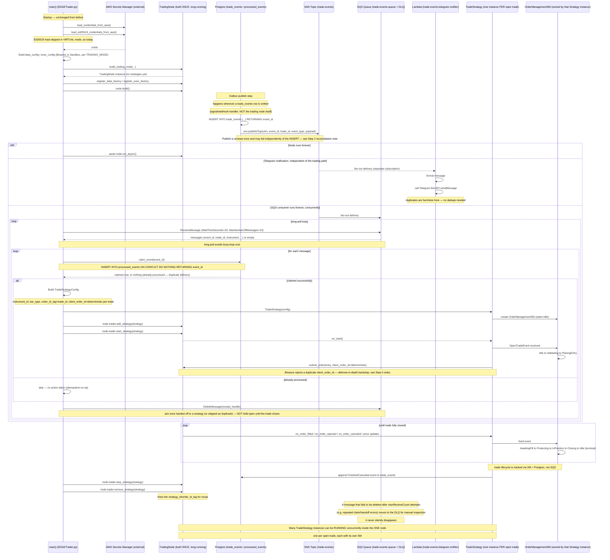

```mermaid
sequenceDiagram
    participant Main as main() (EDGETrader.py)
    participant AWS as AWS Secrets Manager (external)
    participant Node as TradingNode (built ONCE, long-running)
    participant PG as Postgres (trade_events / processed_events)
    participant SNS as SNS Topic (trade-events)
    participant SQS as SQS Queue (trade-events-queue + DLQ)
    participant TG as Lambda (trade-events-telegram-notifier)
    participant Strategy as TradeStrategy (one instance PER open trade)
    participant SM as OrderManagementSM (owned by that Strategy instance)

    Note over Main: Startup — unchanged from before
    Main->>AWS: load_credentials_from_aws()
    Main->>AWS: load_ed25519_credentials_from_aws()
    Note over Main: Ed25519 load skipped in VIRTUAL mode, as today
    AWS-->>Main: creds

    Main->>Main: Build data_config / exec_config (Binance or Sandbox, per TRADING_MODE)
    Main->>Node: build_trading_node(...)
    Node-->>Main: TradingNode instance (no strategies yet)

    Main->>Node: register_data_factory / register_exec_factory
    Main->>Node: node.build()

    Note over PG: Outbox publish step
    Note over PG: happens wherever a trade_events row is written
    Note over PG: (signal/webhook handler, NOT the trading node itself)
    PG->>PG: INSERT INTO trade_events (...) RETURNING event_id
    PG->>SNS: sns.publish(TopicArn, event_id, trade_id, event_type, payload)
    Note over PG,SNS: Publish is at-least-once and may fail independently of the INSERT — see Step 2 reconciliation note

    par Node runs forever
        Main->>Node: await node.run_async()
    and Telegram notification, independent of the trading path
        SNS-->>TG: fan-out delivery (separate subscription)
        TG->>TG: format message
        TG->>TG: call Telegram Bot API sendMessage
        Note over TG: duplicates are harmless here — no dedupe needed
    and SQS consumer runs forever, concurrently
        SNS->>SQS: fan-out delivery
        loop long-poll loop
            Main->>SQS: ReceiveMessage (WaitTimeSeconds=20, MaxNumberOfMessages=10)
            SQS-->>Main: messages (event_id, trade_id, instrument, ...) or empty
            Note over Main,SQS: long-poll avoids busy-loop cost

            loop for each message
                Main->>PG: claim_event(event_id)
                Note over Main,PG: INSERT INTO processed_events ON CONFLICT DO NOTHING RETURNING event_id
                PG-->>Main: claimed row, or nothing (already processed — duplicate delivery)

                alt claimed successfully
                    Main->>Main: Build TradeStrategyConfig
                    Note over Main: instrument_id, bar_type, order_id_tag=trade_id, client_order_id=deterministic-per-trade
                    Main->>Strategy: TradeStrategy(config)
                    Strategy->>SM: create OrderManagementSM (state=Idle)

                    Main->>Node: node.trader.add_strategy(strategy)
                    Main->>Node: node.trader.start_strategy(strategy)
                    Node-->>Strategy: on_start()

                    Strategy->>SM: OpenTradeEvent received
                    SM->>SM: Idle to Validating to PlacingEntry
                    Strategy->>Node: submit_order(entry, client_order_id=deterministic)
                    Note over Strategy,Node: Binance rejects a duplicate client_order_id — defense-in-depth backstop, see Step 5 notes
                else already processed
                    Main->>Main: skip — no action taken (idempotent no-op)
                end

                Main->>SQS: DeleteMessage(receipt_handle)
                Note over Main,SQS: ack once handed off to a strategy (or skipped as duplicate) — NOT held open until the trade closes
            end
        end
    end

    loop until trade fully closed
        Node->>Strategy: on_order_filled / on_order_rejected / on_order_canceled / price updates
        Strategy->>SM: feed event
        SM->>SM: AwaitingFill to Protecting to InPosition to Closing to Idle (terminal)
    end
    Note over Strategy,SM: trade lifecycle is tracked via SM + Postgres, not SQS

    Strategy->>PG: append Finished/Canceled event to trade_events
    Main->>Node: node.trader.stop_strategy(strategy)
    Main->>Node: node.trader.remove_strategy(strategy)
    Note over Node: frees the strategy_id/order_id_tag for reuse

    Note over SQS: A message that fails to be deleted after maxReceiveCount attempts
    Note over SQS: (e.g. repeated claim/handoff errors) moves to the DLQ for manual inspection
    Note over SQS: it never silently disappears

    Note over Node,Strategy: Many TradeStrategy instances can be RUNNING concurrently inside the ONE node
    Note over Node,Strategy: one per open trade, each with its own SM
```
