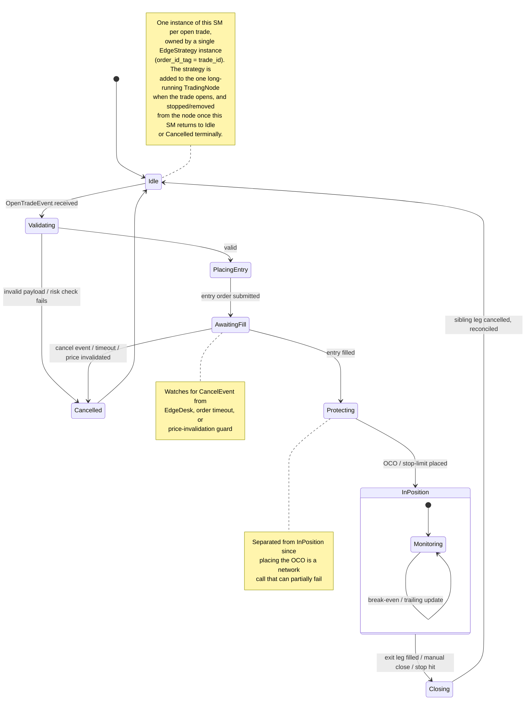

```mermaid
stateDiagram-v2
    [*] --> Idle

    Idle --> Validating: OpenTradeEvent received

    Validating --> Cancelled: invalid payload / risk check fails
    Validating --> PlacingEntry: valid

    PlacingEntry --> AwaitingFill: entry order submitted

    AwaitingFill --> Cancelled: cancel event / timeout / price invalidated
    AwaitingFill --> Protecting: entry filled

    Protecting --> InPosition: OCO / stop-limit placed

    state InPosition {
        [*] --> Monitoring
        Monitoring --> Monitoring: break-even / trailing update
    }

    InPosition --> Closing: exit leg filled / manual close / stop hit

    Closing --> Idle: sibling leg cancelled, reconciled
    Cancelled --> Idle

    note right of AwaitingFill
        Watches for CancelEvent from
        EdgeDesk, order timeout, or
        price-invalidation guard
    end note

    note right of Protecting
        Separated from InPosition since
        placing the OCO is a network
        call that can partially fail
    end note

    note left of Idle
        One instance of this SM per open trade,
        owned by a single EdgeStrategy instance
        (order_id_tag = trade_id). The strategy is
        added to the one long-running TradingNode
        when the trade opens, and stopped/removed
        from the node once this SM returns to Idle
        or Cancelled terminally.
    end note
```
