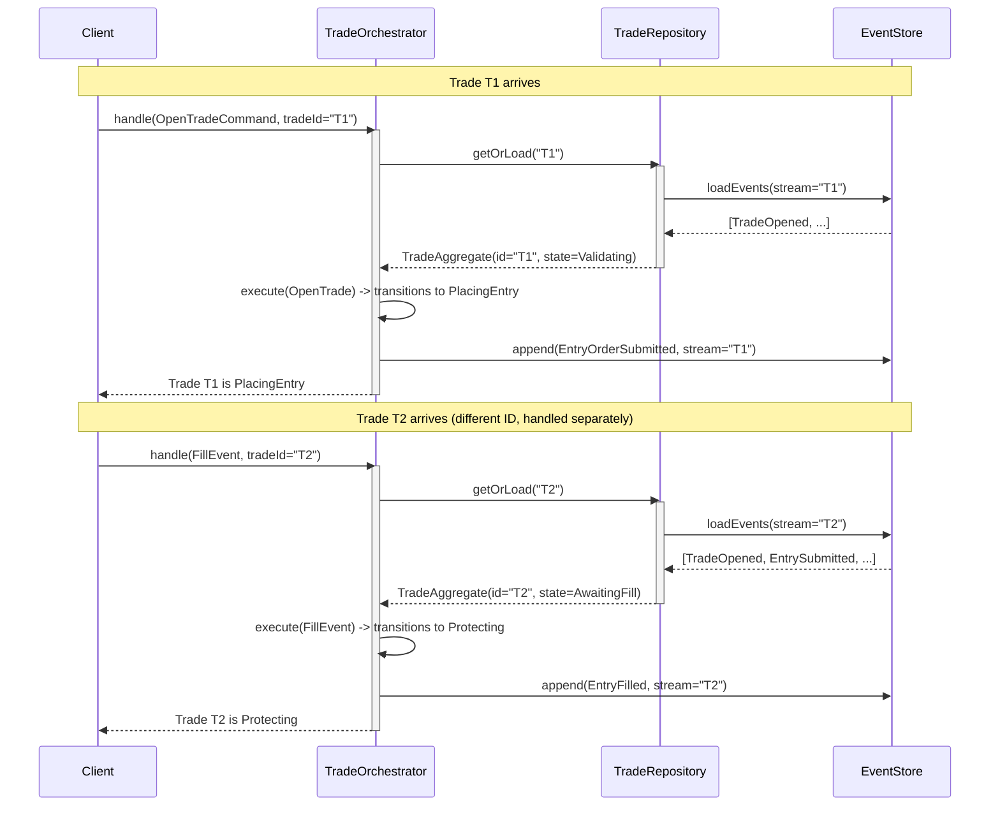

```mermaid
sequenceDiagram
    participant Client
    participant TradeOrchestrator
    participant TradeRepository
    participant EventStore

    Note over Client, EventStore: Trade T1 arrives

    Client->>TradeOrchestrator: handle(OpenTradeCommand, tradeId="T1")
    activate TradeOrchestrator
    TradeOrchestrator->>TradeRepository: getOrLoad("T1")
    activate TradeRepository
    TradeRepository->>EventStore: loadEvents(stream="T1")
    EventStore-->>TradeRepository: [TradeOpened, ...]
    TradeRepository-->>TradeOrchestrator: TradeAggregate(id="T1", state=Validating)
    deactivate TradeRepository

    TradeOrchestrator->>TradeOrchestrator: execute(OpenTrade) -> transitions to PlacingEntry
    TradeOrchestrator->>EventStore: append(EntryOrderSubmitted, stream="T1")
    TradeOrchestrator-->>Client: Trade T1 is PlacingEntry
    deactivate TradeOrchestrator

    Note over Client, EventStore: Trade T2 arrives (different ID, handled separately)

    Client->>TradeOrchestrator: handle(FillEvent, tradeId="T2")
    activate TradeOrchestrator
    TradeOrchestrator->>TradeRepository: getOrLoad("T2")
    activate TradeRepository
    TradeRepository->>EventStore: loadEvents(stream="T2")
    EventStore-->>TradeRepository: [TradeOpened, EntrySubmitted, ...]
    TradeRepository-->>TradeOrchestrator: TradeAggregate(id="T2", state=AwaitingFill)
    deactivate TradeRepository

    TradeOrchestrator->>TradeOrchestrator: execute(FillEvent) -> transitions to Protecting
    TradeOrchestrator->>EventStore: append(EntryFilled, stream="T2")
    TradeOrchestrator-->>Client: Trade T2 is Protecting
    deactivate TradeOrchestrator
```
