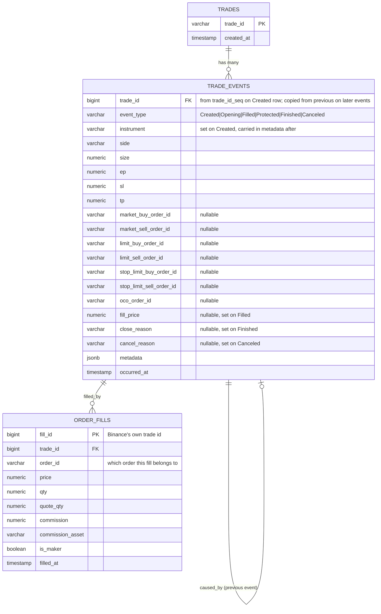

```mermaid
erDiagram
    TRADES ||--o{ TRADE_EVENTS : "has many"
    TRADE_EVENTS ||--o| TRADE_EVENTS : "caused_by (previous event)"

    TRADES {
        varchar trade_id PK
        timestamp created_at
    }

    TRADE_EVENTS {
        bigint trade_id FK "from trade_id_seq on Created row; copied from previous on later events"
        varchar event_type "Created|Opening|Filled|Protected|Finished|Canceled"
        varchar instrument "set on Created, carried in metadata after"
        varchar side
        numeric size
        numeric ep
        numeric sl
        numeric tp
        varchar market_buy_order_id "nullable"
        varchar market_sell_order_id "nullable"
        varchar limit_buy_order_id "nullable"
        varchar limit_sell_order_id "nullable"
        varchar stop_limit_buy_order_id "nullable"
        varchar stop_limit_sell_order_id "nullable"
        varchar oco_order_id "nullable"
        numeric fill_price "nullable, set on Filled"
        varchar close_reason "nullable, set on Finished"
        varchar cancel_reason "nullable, set on Canceled"
        jsonb metadata
        timestamp occurred_at
    }

    TRADE_EVENTS ||--o{ ORDER_FILLS : "filled_by"

    ORDER_FILLS {
        bigint fill_id PK "Binance's own trade id"
        bigint trade_id FK
        varchar order_id "which order this fill belongs to"
        numeric price
        numeric qty
        numeric quote_qty
        numeric commission
        varchar commission_asset
        boolean is_maker
        timestamp filled_at
    }
```
