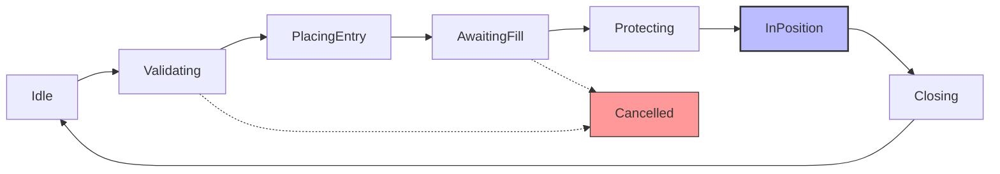

```mermaid
graph LR
    A[Idle] --> B[Validating] --> C[PlacingEntry] --> D[AwaitingFill] --> E[Protecting] --> F[InPosition] --> G[Closing] --> A
    
    B -.-> X[Cancelled]
    D -.-> X
    
    style F fill:#bbf,stroke:#333,stroke-width:2px
    style X fill:#f99,stroke:#333,stroke-width:1px
```
