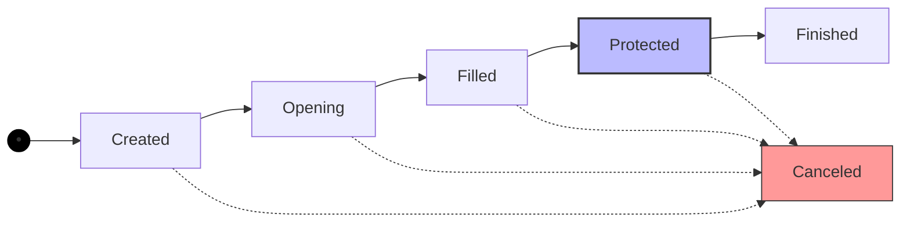

```mermaid
graph LR
    S((•)) --> A[Created] --> B[Opening] --> C[Filled] --> D[Protected] --> E[Finished]

    A -.-> X[Canceled]
    B -.-> X
    C -.-> X
    D -.-> X

    style S fill:#000,stroke:#000,stroke-width:2px
    style D fill:#bbf,stroke:#333,stroke-width:2px
    style X fill:#f99,stroke:#333,stroke-width:1px
```
